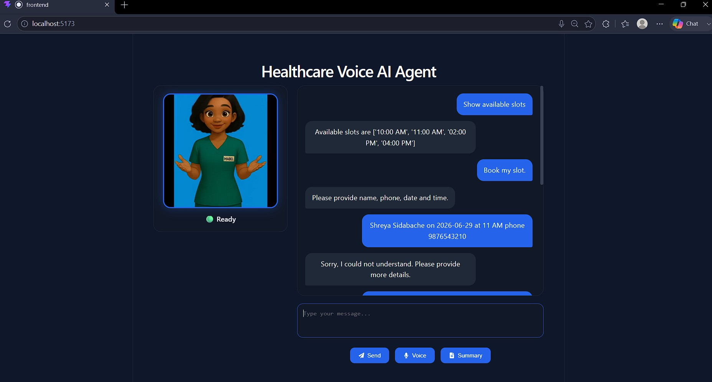
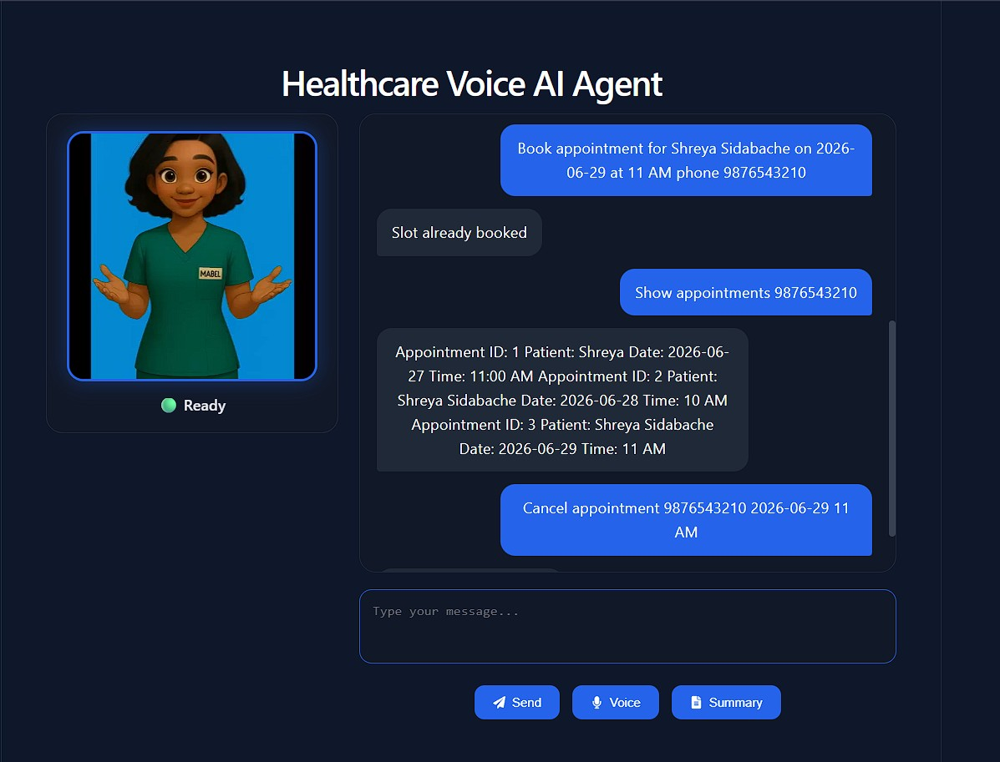
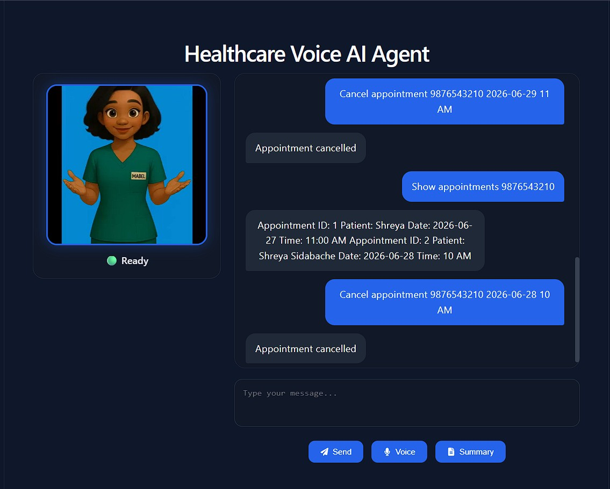
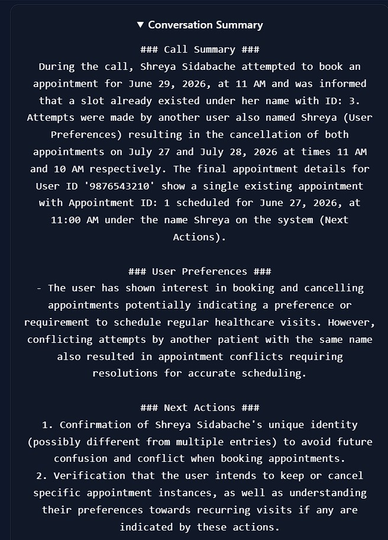

# 🏥 Healthcare Voice AI Assistant


An AI-powered Healthcare Voice Assistant that enables users to interact using both voice and text to manage healthcare appointments.

The assistant supports appointment booking, retrieval, cancellation, modification, speech-to-text transcription, AI-generated medical summaries, and realistic text-to-speech responses through an interactive avatar interface.

---

# 🚀 Features

## 🎙️ Voice Interaction

* Speech-to-Text using OpenAI Whisper
* Text-to-Speech voice responses
* Real-time conversational experience

## 🤖 AI-Powered Intent Recognition

Uses an LLM through Ollama to identify user intent and route requests to appropriate healthcare services.

Supported Intents:

* Show Available Slots
* Book Appointment
* Retrieve Appointments
* Cancel Appointment
* Modify Appointment
* End Conversation

## 📅 Appointment Management

Users can:

* View available slots
* Book appointments
* Retrieve existing bookings
* Modify appointments
* Cancel appointments

## 📝 Conversation Summary

Generates a summary of the complete conversation for future reference.

## 🎥 Interactive Avatar

Animated healthcare assistant avatar that responds during speech output.

---

# 🏗️ System Architecture

User Voice/Text
↓
React Frontend
↓
FastAPI Backend
↓
Whisper STT
↓
Intent Detection (Ollama LLM)
↓
Appointment Management Tools
↓
Text-to-Speech Engine
↓
Avatar Response

---

# 🛠️ Tech Stack

## Frontend

* React.js
* Axios
* React Icons
* CSS3

## Backend

* FastAPI
* Uvicorn
* Python

## AI Components

* OpenAI Whisper
* Ollama
* Phi-3 Mini
* Text-to-Speech Engine

## Data Storage

* JSON-based Appointment Database

---

# 📂 Project Structure

```text
Healthcare-Voice-AI-Agent/
│
├── backend/
│   ├── main.py
│   ├── agent.py
│   ├── tools.py
│   ├── summary.py
│   ├── appointments.json
│   └── requirements.txt
│
├── frontend/
│   ├── src/
│   │   ├── App.jsx
│   │   ├── App.css
│   │   └── main.jsx
│   │
│
├── screenshots/
│   ├── UI1.jpg
│   ├── UI2.jpg
│   ├── UI3.jpg
│   ├── summary.jpg
│   
│
└── package.json
└── README.md
```

# ⚙️ Installation

## Clone Repository

```bash
git clone https://github.com/Shreya140724/Healthcare-Voice-AI-Assistant.git

cd Healthcare-Voice-AI-Assistant
```

## Backend Setup

```bash
cd backend

conda create -n voiceai python=3.10

conda activate voiceai
```

Install dependencies:

```bash
pip install -r requirements.txt
```

Install Ollama:

```bash
ollama pull phi3:mini
```

Start backend:

```bash
uvicorn main:app --reload
```

---

## Frontend Setup

```bash
cd frontend

npm install
```

Run frontend:

```bash
npm run dev
```

---

# 🎯 Example Commands

## Show Available Slots

```text
Show available slots
```

## Book Appointment

```text
Book appointment for Shreya Sidabache on 2026-06-29 at 11 AM phone 9876543210
```

## Retrieve Appointments

```text
Show appointments 9876543210
```

## Cancel Appointment

```text
Cancel appointment 9876543210 2026-06-29 11 AM
```

## Modify Appointment

```text
Reschedule appointment 9876543210 from 2026-06-29 11 AM to 2026-06-29 2 PM
```

---

## 📸 Demo Screenshots

### Home Screen & Available Slots



### Appointment Booking



### Retrieve Appointments &  Cancel Appointments



### Modify Booking


### Conversation Summary




# 📊 Sample Workflow

1. User asks for available slots.
2. System displays available appointment timings.
3. User books an appointment.
4. Appointment is stored in the database.
5. User retrieves or modifies appointments.
6. Voice assistant responds with confirmation.
7. Conversation summary can be generated.

---

# 🔒 Future Improvements

* Doctor-specific appointment scheduling
* Multi-language support
* Database integration (MySQL/PostgreSQL)
* Authentication and patient login
* Calendar integration
* Real-time appointment notifications
* Cloud deployment

---

# 👩‍💻 Author

**Shreya Sidabache**

M.Tech in Artificial Intelligence

---
